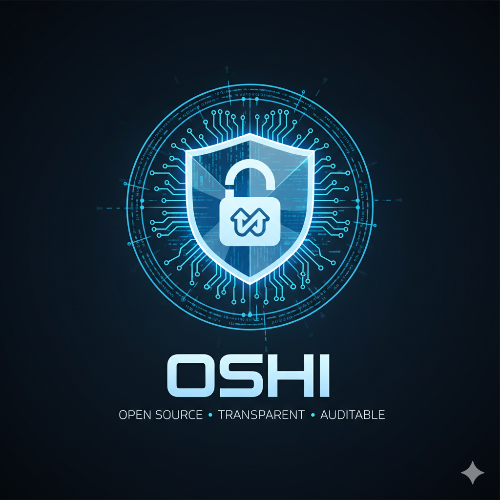

# OSHI Messenger

<p align="center">
  
</p>

<p align="center">
  <strong>🔐 Zero-Knowledge Encrypted Messenger</strong><br>
  <em>Your messages. Your privacy. No compromises.</em>
</p>

<p align="center">
  <a href="https://apps.apple.com/app/oshi-mesh/id6753926350">
    
  </a>
  <a href="https://oshi-messenger.org">
    
  </a>
</p>

---

## 🌟 Features

### 🔒 Military-Grade Encryption
- **X25519** key exchange (Curve25519)
- **AES-256-GCM** message encryption
- **Double Ratchet** protocol (Signal Protocol)
- Forward secrecy & break-in recovery

### 📡 Mesh Network
- Direct P2P communication
- No server for local messages
- Works offline between nearby devices
- Automatic peer discovery

### ☁️ Fallback Options
- IPFS for asynchronous messages
- VPS relay for voice calls
- Always end-to-end encrypted

### 🎭 Privacy by Design
- No phone number required
- No central account
- No metadata collection
- Keys never leave your device

### 📞 Encrypted Voice Calls
- Real-time E2E encrypted audio
- Voice effects for anonymity
- Works over mesh or internet

## 🛡️ Security Architecture

```
┌─────────────────────────────────────────────────────────┐
│                    OSHI Security                         │
├─────────────────────────────────────────────────────────┤
│                                                         │
│  ┌─────────┐    E2E Encrypted    ┌─────────┐          │
│  │ Device  │◄──────────────────►│ Device  │          │
│  │    A    │                     │    B    │          │
│  └────┬────┘                     └────┬────┘          │
│       │                               │               │
│       │    ┌─────────────────┐       │               │
│       └───►│  Mesh Network   │◄──────┘               │
│            │   (Direct P2P)  │                        │
│            └────────┬────────┘                        │
│                     │                                 │
│            ┌────────▼────────┐                        │
│            │ IPFS / VPS      │                        │
│            │ (Encrypted      │                        │
│            │  Fallback)      │                        │
│            └─────────────────┘                        │
│                                                         │
│  🔐 Encryption: AES-256-GCM                            │
│  🔑 Key Exchange: X25519 (ECDH)                        │
│  🔄 Protocol: Double Ratchet                           │
│                                                         │
└─────────────────────────────────────────────────────────┘
```

## 📱 Screenshots

<p align="center">
  
  
  
</p>

## 🔍 Security Verification

We publish our security architecture for transparency. See [SECURITY.md](SECURITY.md) for:

- Cryptographic algorithms used
- Protocol details
- Security properties
- How to audit our claims
- Responsible disclosure policy
- Bug bounty program

## 📊 Comparison

| Feature | OSHI | Signal | Telegram | WhatsApp |
|---------|------|--------|----------|----------|
| E2E Encryption | ✅ | ✅ | ⚠️ Secret only | ✅ |
| No Phone Required | ✅ | ❌ | ❌ | ❌ |
| Mesh Network | ✅ | ❌ | ❌ | ❌ |
| Open Protocol | ✅ | ✅ | ❌ | ❌ |
| Decentralized | ✅ | ❌ | ❌ | ❌ |
| Voice Effects | ✅ | ❌ | ❌ | ❌ |

## 🌍 Supported Languages

🇺🇸 English • 🇫🇷 Français • 🇩🇪 Deutsch • 🇪🇸 Español • 🇮🇹 Italiano • 🇵🇹 Português • 🇷🇺 Русский • 🇺🇦 Українська • 🇵🇱 Polski • 🇯🇵 日本語 • 🇨🇳 中文 • 🇸🇦 العربية • 🇮🇱 עברית

## 📜 License

This software is proprietary. See [LICENSE](LICENSE) for details.

**You may:**
- View the security documentation
- Audit our cryptographic claims
- Report vulnerabilities

**You may not:**
- Copy, modify, or distribute the software
- Use any code in commercial products
- Create derivative works

## 📬 Contact

- **Website**: https://oshi-messenger.org
- **Security**: security@oshi-messenger.com
- **Support**: support@oshi-messenger.com
- **Twitter**: @OSHIMessenger

## 🙏 Acknowledgments

- [CryptoKit](https://developer.apple.com/documentation/cryptokit) - Apple's cryptography framework
- [Signal Protocol](https://signal.org/docs/) - Double Ratchet inspiration
- [IPFS](https://ipfs.io) - Decentralized storage
- [Pinata](https://pinata.cloud) - IPFS pinning service

---

<p align="center">
  <strong>Made with ❤️ in Switzerland 🇨🇭</strong><br>
  <em>Privacy is not a luxury, it's a right.</em>
</p>
