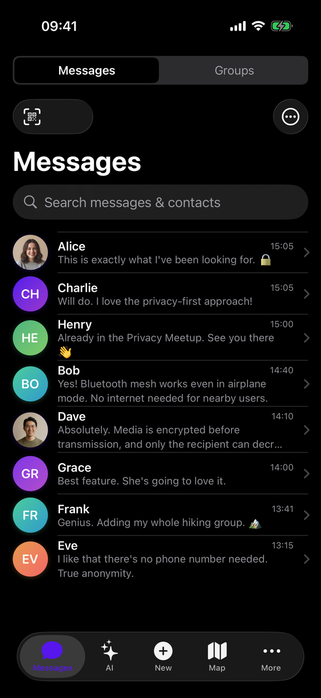
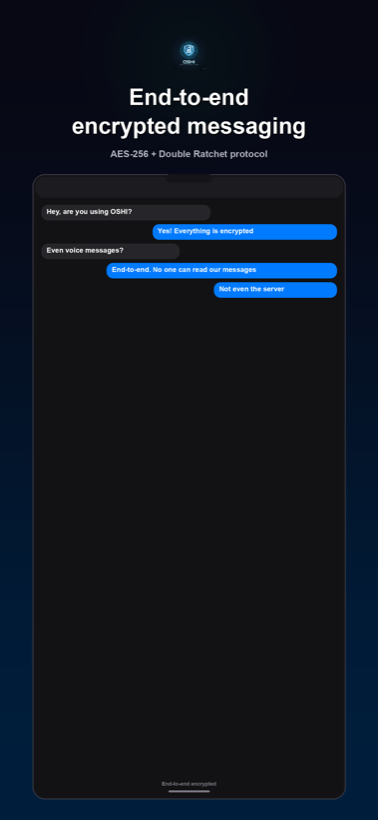
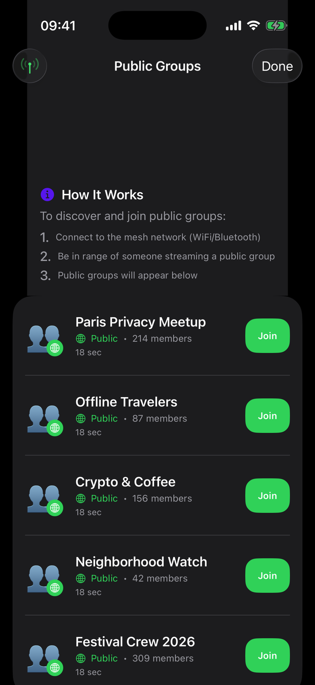
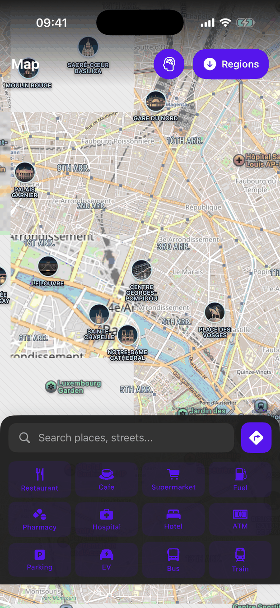

<p align="center">
  
</p>

<h1 align="center">OSHI</h1>

<p align="center">
  <b>Send a message with no internet, no SIM card, and no account.</b><br>
  Phones relay for each other over Bluetooth. Everything is end-to-end encrypted.
</p>

<p align="center">
  <a href="https://apps.apple.com/app/oshi-mesh/id6753926350"></a>
  <a href="https://github.com/Lastoneparis/OSHI/actions/workflows/verify.yml"></a>
  <a href="docs/protocol.md"></a>
  <a href="src/"></a>
  <a href="LICENSE"></a>
  <a href="https://oshi-messenger.com"></a>
</p>

---

## The one thing OSHI does that others don't

Turn on airplane mode. Open OSHI. **Your messages still send.**

Nearby phones running OSHI form a Bluetooth mesh and pass encrypted packets for
each other, hop by hop, until one of them reaches the recipient — or reaches the
internet. No cell tower, no Wi-Fi, no server in between.

That matters in three situations, and they are not hypothetical:

- **A protest or a stadium** where the cell network is saturated or shut off.
- **A plane, a boat, a basement, a mountain** — anywhere with no coverage.
- **A country that cuts the internet.** OSHI needs no VPN to keep working locally.

Everything else — the encryption, the absence of a phone number, the disappearing
messages — exists in other apps too. This one does not.

<p align="center">
  
  
  
  
</p>

---

## How the encryption works

OSHI implements the **Double Ratchet** with **X3DH** key agreement — the same
construction Signal uses — with AES-256-GCM for message encryption and Curve25519
for key exchange. Forward secrecy and post-compromise security both hold: an
attacker who steals today's keys can read neither yesterday's messages nor
tomorrow's.

Your identity is a keypair generated on your device. There is no phone number, no
email, no account, and nothing to seize. You add someone by scanning a QR code or
pasting their public key.

The implementation is in this repository and you can read it:

| File | What it is |
|------|-----------|
| [`src/DoubleRatchet.swift`](src/DoubleRatchet.swift) | The ratchet: chain keys, skipped-message keys, DH steps |
| [`src/OSHICryptoV2.swift`](src/OSHICryptoV2.swift) | X3DH, AEAD, the header format |
| [`src/MeshNetworkManager.swift`](src/MeshNetworkManager.swift) | Peer discovery, routing, store-and-forward |
| [`src/CrossPlatformMesh.swift`](src/CrossPlatformMesh.swift) | The iOS ↔ Android bridge: BLE presence, Bonjour discovery, TCP transport |
| [`src/MeshRelay.swift`](src/MeshRelay.swift) | Multi-hop relay: hop ceiling, loop suppression, dedup cache |
| [`docs/protocol.md`](docs/protocol.md) | The wire protocol, in full |
| [`docs/encryption.md`](docs/encryption.md) | Threat model and key lifecycle |

**On "open source", precisely:** the cryptographic core, the mesh layer and the
bot SDK are published here under MIT. The application shell around them — UI,
App Store plumbing, media pipeline — is not. We would rather tell you exactly
what you can audit than claim a green checkmark we have not earned. If you find a
flaw in what is published, see the bug bounty below.

---

## Also in the app

**Steganography.** Hide a message inside an ordinary photo. The carrier image
looks and opens like any other picture.

**Covert channels.** Traffic that resembles ordinary HTTPS requests, for networks
that block or fingerprint messengers.

**Offline AI.** A local model runs on the device. Nothing is sent anywhere.

**Encrypted voice and video calls**, peer-to-peer where the network allows it,
relayed through a blind TURN server where it does not.

**Bot API** with a [Python SDK](sdk/) — build a bot that talks to a group without
ever touching a phone number.

---

## How OSHI compares

| | OSHI | Signal | Session | Briar |
|---|:---:|:---:|:---:|:---:|
| Works with **no internet at all** | ✅ | ❌ | ❌ | ✅ |
| No phone number required | ✅ | ❌ | ✅ | ✅ |
| Double Ratchet encryption | ✅ | ✅ | ✅ | ✅ |
| Encrypted voice calls | ✅ | ✅ | ✅ | ❌ |
| Steganography | ✅ | ❌ | ❌ | ❌ |
| Offline on-device AI | ✅ | ❌ | ❌ | ❌ |
| Bot API | ✅ | ❌ | ❌ | ❌ |
| Fully open source | ⚠️ core | ✅ | ✅ | ✅ |

Briar is the closest thing to OSHI and deserves the credit: it pioneered
offline-first messaging on Android. OSHI brings the same idea to iOS, adds voice
calls and a bot API, and is fully open about which parts you can audit.

---

## Bot SDK

```bash
pip install requests   # the SDK has no other dependency
```

```python
from oshi_bot import OSHIBot

bot = OSHIBot(token="your-bot-token")        # created inside the OSHI app
bot.send_message(group_id="...", text="Deploy finished ✅")

@bot.on_message
def echo(msg):
    bot.reply(msg, f"You said: {msg.text}")
```

Full reference: [`sdk/README.md`](sdk/README.md) · [`docs/bot-api.md`](docs/bot-api.md)

---

## Security

Report a vulnerability privately: **security@oshi-messenger.com**
Please do not open a public issue for a security bug.

**Bug bounty**, paid from a solo developer's own pocket, so the numbers are
honest rather than impressive:

| Severity | Example | Reward |
|---|---|---|
| Critical | Break the encryption, read messages you should not | $500 |
| High | Bypass authentication, impersonate a user | $250 |
| Medium | Leak metadata the protocol promises to hide | $100 |

Details and threat model: [`Security.md`](Security.md)

---

## Contributing

Issues and pull requests are welcome — especially on the cryptographic core,
where a second pair of eyes is worth more than a feature.

- Found a bug? [Open an issue](https://github.com/Lastoneparis/OSHI/issues/new/choose)
- Read [`CONTRIBUTING.md`](CONTRIBUTING.md) before a pull request
- Not a coder? Starring the repository genuinely helps people find it

---

## Download

<a href="https://apps.apple.com/app/oshi-mesh/id6753926350">
  
</a>

iOS and macOS. Android is in closed testing.

---

<p align="center">
  <sub>Built by one person, in the open, because privacy should not require trusting a company.</sub><br>
  <sub>MIT licensed · <a href="https://oshi-messenger.com">oshi-messenger.com</a></sub>
</p>
